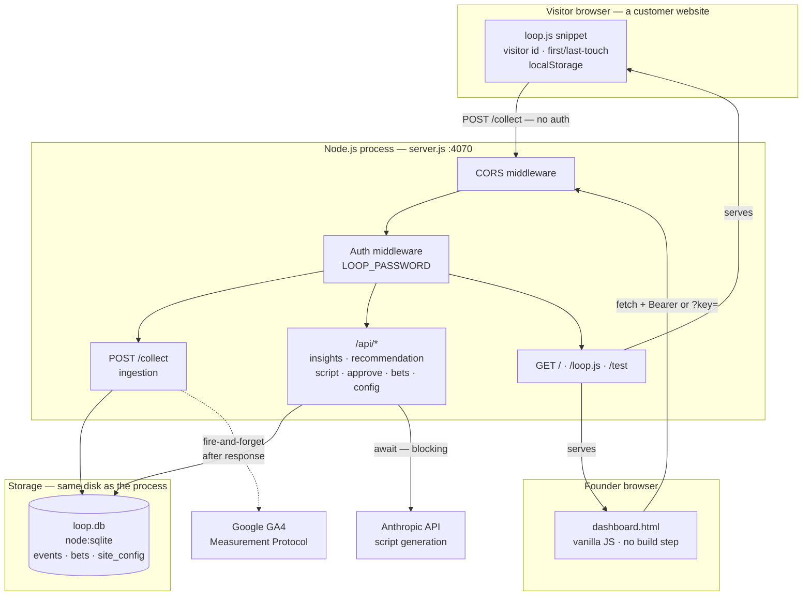
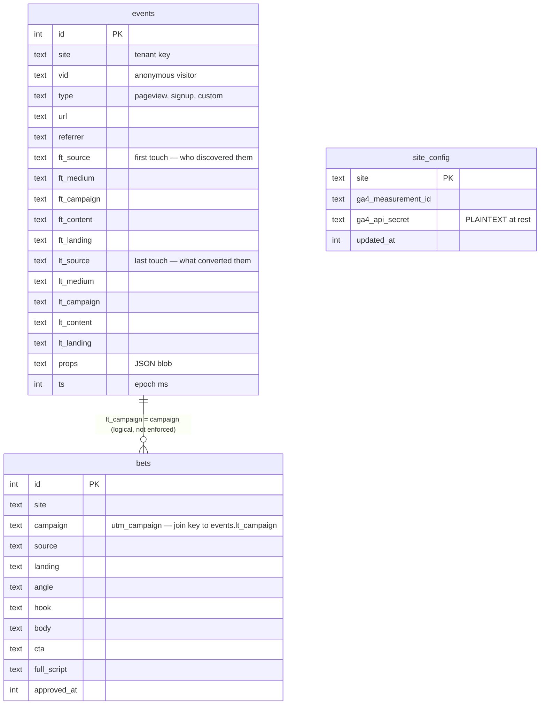

# Loop — System Architecture

> What this system *is*, as built. Written from the code, not from intent.
> Companion to README (what it does) and DEPLOY (how to run it).

## 1. The shape in one sentence

Loop is a **single-process monolith**: one Node.js server that is simultaneously the
API, the static file server, the dashboard host, and — via an embedded SQLite file —
its own database. There is no separate frontend build, no database server, no cache
layer, no message queue.

## 2. Component map



## 3. The five stages, mapped to code

The product is a loop. Each stage is a specific endpoint:

| Stage | Endpoint | Function | What it does |
|---|---|---|---|
| **Sense** | `POST /collect` | inline | Writes one row per event to `events` |
| **Decide** | `GET /api/insights` | `computeInsights()` | Aggregates by first-touch source; flags anomalies |
| | `GET /api/recommendation` | inline | Picks the strongest above-average source, with evidence |
| **Create** | `GET /api/generate-scripts` | `callClaude()` | 3 AI scripts; cold-start vs warm mode |
| | `GET /api/script` | `generateScript()` | Template fallback, no API key needed |
| **Approve** | `POST /api/approve` | inline | Persists script(s) to `bets` with unique UTM campaigns |
| **Measure** | `GET /api/bets` | `betsWithResults()` | Recomputes each bet's 7-day signup count live |
| | `GET /api/measure` | inline | Single-campaign attribution |

Feedback edge: `bets` (Approve) is read back by `generate-scripts` (Create). That read
is what closes the loop — warm mode conditions on past script text plus measured results.

## 4. Request lifecycle — a tracked pageview

Understanding one request end to end explains most of the system:

1. A visitor loads a customer site. `<script src=".../loop.js" data-site="my-saas">` runs.
2. The snippet reads or creates an anonymous `vid` in `localStorage` (16 random bytes, hex).
3. It computes **first touch** (written once, never overwritten) and **last touch**
   (refreshed on a new session — 30 min idle, or an arrival carrying a UTM/referrer).
4. It calls `send('pageview')` → `navigator.sendBeacon` (survives page unload), falling
   back to `fetch(..., {keepalive: true})`.
5. Server: CORS middleware sets `Access-Control-Allow-Origin: *`.
6. Server: auth middleware — `/collect` is in `PUBLIC_PATHS`, so it passes with no password.
   *(It has to: a visitor's browser has no way to hold your password.)*
7. Handler validates `site`/`vid`/`type`, truncates every string field, inserts one row.
8. **Responds `204` immediately** — our own write is the source of truth.
9. *After* responding, if this site has GA4 config, it forwards a translated copy to
   Google fire-and-forget. GA4 can never slow down or break ingestion.

## 5. Data model

Three tables in one SQLite file. No foreign keys — tables are joined in application code.



**The central modelling decision — two attributions, two jobs:**

- `ft_*` (first touch) answers *"which channel creates demand?"* → drives insights and
  recommendations.
- `lt_*` (last touch) answers *"did this specific campaign work?"* → drives bet measurement.

Storing both is why the loop can discover channels *and* grade its own bets.

**Results are never stored.** `betsWithResults()` recomputes signup counts from `events`
on every call. Slower, but a bet's measured result can never go stale or drift.

**Indexes:** `(site, ts)` and `vid` on events; `(site, approved_at)` on bets.

## 6. Technology choices and their consequences

| Choice | Why it's good | What it costs |
|---|---|---|
| `node:sqlite` (Node 22 built-in) | Zero native deps, no DB server, no install pain | **Synchronous** — every query blocks the event loop. One slow query stalls all requests. |
| Single file, single process | Trivial to read, deploy, and reason about | No horizontal scaling; a crash takes everything down |
| Static HTML, no build step | No bundler, no npm audit churn, instant edits | No components, no type checking, no minification |
| Express 5 | Async route errors auto-forward to the error handler | Only one dependency, but unpinned (`^5.2.1`) |
| Recompute over cache | Results are always correct | O(bets) queries per dashboard load |

## 7. Trust boundaries — who can reach what

```
PUBLIC (no password — by necessity)
  POST /collect      any browser on the internet can write rows
  GET  /loop.js      must be fetchable by visitor browsers

PROTECTED (LOOP_PASSWORD, when set)
  GET  /             dashboard
  GET  /api/*        all reads and writes, including config

UNPROTECTED WHEN LOOP_PASSWORD IS UNSET
  everything above — the server warns at boot but still starts
```

`/collect` being public and unauthenticated is a deliberate and necessary tradeoff, but
it means **anyone who knows a site name can write arbitrary events into that site's data**.

## 8. Known architectural gaps

Recorded honestly, in the order we plan to address them:

- **Config is not centralized.** `DEPLOY.md` documents a `LOOP_DB` variable the code does
  not read; the DB path is hardcoded (`server.js:17`).
- **No test suite.** `npm test` exits 1.
- **No error-handling middleware, no request logging, no `/health` endpoint.**
- **Auth is a single shared password**, compared with `===` (not constant-time), and often
  passed in a URL query string (leaks into server logs and `Referer` headers).
- **`Access-Control-Allow-Origin: *` applies to `/api/*`**, not only to `/collect`.
- **No caching.** `/loop.js` — the hottest path in the system — is read from disk and sent
  uncompressed on every pageview of every tracked site.
- **No CI, no deployment pipeline, no monitoring, no alerting.**
- **N+1 query** in `betsWithResults()` — `db.prepare()` is called inside a loop.
- **Conversion-event picker is half-wired**: `/api/insights` honors `?event=`, but
  `/api/recommendation` and `/api/script` ignore it and silently assume `signup`.
